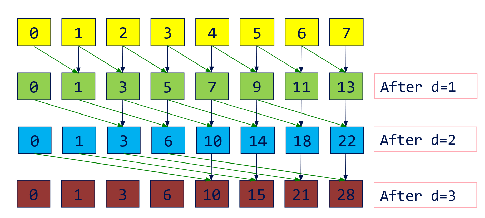
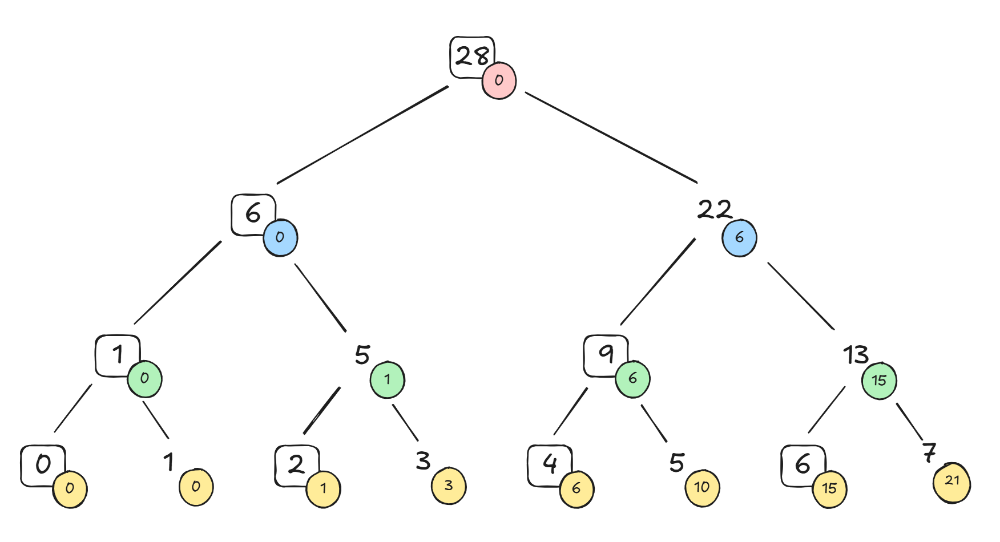
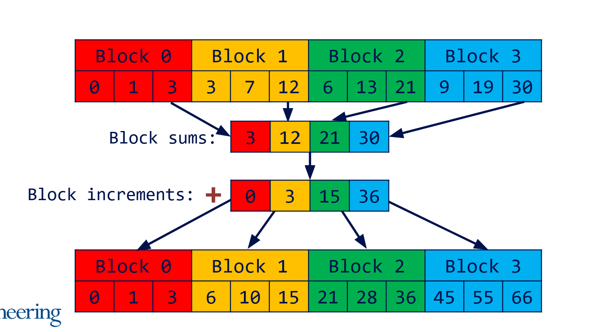

**University of Pennsylvania, CIS 565: GPU Programming and Architecture, Project 2**

# fast parallel scans

*A fast cuda scan implementation that sometimes beats thrust :).*

## specs

- Zachary Leong
  - [LinkedIn](https://linkedin.com/in/zleong), [personal website](https://zacharyleong.com)
- Tested on: Windows 11, Ultra 9 185H @ 2.30GHz 32GB, RTX 4060 Laptop (personal)

## overview

This project is an implementation of parallel scan algorithms (also known as prefix sums), and it's applications in other parallel algorithms like stream compaction.

In this proejct, I attempt to close the performance gap between my implementation and NVIDIA's Thrust library scan implementation in CUDA. 

## background

A prefix sum is an algorithm that computes the sum of everything before it at each index for an entire array. For example, `[0, 1, 2, 3, 4] -> [0, 0, 1, 3, 6]`. In this case, this would be an "exclusive" scan, because we don't include the value at the index in the sum (if we do include the value at the index in the sum, it is called an "inclusive" scan).

On the cpu, the algorithm for computing the prefix sum is trivial and fast (inclusive):

```
for i = 1..=n-1:
  a[i] += a[i - 1]
```

However, the parallel algorithm is not quite as simple.

Prefix sums have a variety of powerful applicataions in computing, including radix sorting and stream compaction.

## algorithms

Here is the list of implementations, in the order of less to more optimized:

### cpu
The algorithm showed in background. This algorithm performs O(n) add operations.

### naive parallel

The puesdo code for the naive gpu algorithm:
```
for d = 1 to log2n
  for all k in parallel
    if (k >= 2d-1)
      x[k] = x[k – 2d-1] + x[k];
```


This algorithm performs O(nlog2n) add operations, which is a order higher than the cpu implementation.

### work efficient parallel

Perform an upsweep (add left and right child as you go up the tree) and a down sweep (keep track of the sum of everything before itself). 



In the diagram above, the boxed elements are the ones stored in-place on the up sweep. The colored circles represent the values that are stored on the downsweep. This diagram mostly intuits how the down-sweep works, as that is the part of the algorithm that most people find confusing.

The way I think about the down sweep is each node represents a range, and you pass down:
- to the left child: the sum of everything before this range
- to the right child: the sum of everything before this range + the sum of the left subtree/range

This works because at each layer, we store at each node "the sum of everything before me", and by the time you get to the last layer, the sum of everything before the leaf node is the exclusive prefix sum.

Like induction :).

This algorithm performs an exclusive scan with O(n) add operations, matching the cpu algorithm, but with parallel efficiency.

## catching up to thrust

### shared memory

The high level overview of this implementation is we break the array into chunks, perform a scan for each chunk (1 block : 1 chunk), and then combine them together as follows:



Since each block handles one chunk of the array, we can effectively utilize shared memory. Each thread in each block handles 2 elements, and the kernel handles the upsweep and the down sweep as we can use `__syncthreads()` to synchronize between warps within the same block.

### arbitrary array sizes

Here is where it gets tricky: the issue is our block sums array may larger than the chunk size that each block can handle, so have to *recursively* perform a scan on the block sum array.

In addition to this, we have to handle array sizes that may not be a power of two. Luckily, with our chunking implementation, we only have to pad at most the number of elements in a chunk.

I created the a struct and the following `compute_params` function to make this process easier to keep track of.

```c
params compute_params(int n) {
    // one thread handles two elements
    const int chunk_size = threads_per_block << 1;

    int num_chunks = divup(n, chunk_size);
    int pad = (chunk_size - (n % chunk_size)) % chunk_size;
    int padded_size = num_chunks * chunk_size;

    return params{
        chunk_size,
        num_chunks,
        pad,
        padded_size,
    };
}
```

Note that I update this function in the later optimizations, but the general idea remains the same.

### using a heap

The issue with the previous method is we allocate memory at each depth of the recursion for the block sum array. Inspired by descriptor heaps in Vulkan, I decided to pre-compute the total memory we would use for the data and recursive block sums and allocate a "heap". 

Using some clever pointer arithmetic and being careful with padding, writing to a new block sum array is as easy as incrementing the `dev_heap` pointer.

### bank-conflict free indexing

Note: in this implementation, I've updated how I'm accessing global memory to coalesce memory reads:

```c
int ai = local_thid;
int bi = local_thid + (chunk_size >> 1);
```

Shared-memory is a parallel data cache, and in modern gpus, it is able to service 32 memory operations per clock cycle for a given warp. While the current shared-memory implementation saves us from going to global memory when doing the scan, if multiple threads access the same "bank" at the same instruction, we can get a high degree bank conflict, which is serially resolved once per clock cycle (note that there is a different type of access where all threads access the **same address**, which then the hardware performs a efficient broadcast).

In the up-sweep and down-sweep loops, we access the left and right child which are a certain stride apart depending on which depth iteration we are on. However, bank conflicts occur when the indices wrap around past 32, and we end up reading from the same banks, which is more extreme as our strides get larger (especially since our strides are powers of 2).

If we add an offset every time we wrap around 32, then we don't ever hit the same bank within a warp! Thus, by using a macro to increment our indices by `floor(n / 32)`, we can avoid bank conflicts all together, and shared memory reads can happen in parallel across threads per clock cycle.

Note: here I've started to add `#pragma unroll` before our loops to tell the compiler to explicitly write out our instructions to save us additional registers and computations needed to keep track of loop iterations.

### vectorization

This was the last optimization that I made, which was included at the end of the GPU Gems article. The high level idea is: Instead of each thread handling 2 elements, they instead handle 8!

The idea is to break down our chunks into even smaller chunks of 4 ints, and do independent scans int4s, then combine them using the same logic as the block sums. So essentially, we are doing a finer grain of a scan.

In addition, since int4s are 16 bytes each, reducing global memory load instructions and they are naturally aligned.

As for the actual implementation, is it possible to only use an additional 3 registers per int4, and store the 4 value in shared memory, as I do in the code.

Note that each block now handles more 4x more elements, but we perform the up-sweep and down-sweep on the number of elements as before (2 x threads_per_block) since it is only applied to the sums of each int4 (now one layer above the bottom).

Why not do more than 8 elements per thread? More elements, means more registers. Two int4s strikes a good balance between the number of registers used and the number of elements we can process.

In addition to vectorizing the scan kernel, it seemed fitting to vectorize the rest of the kernels.

## performance analysis

### effects of block size

### effects of array size
all
optimized
thrust vs optimized

## modifications to cmakelists

## references
